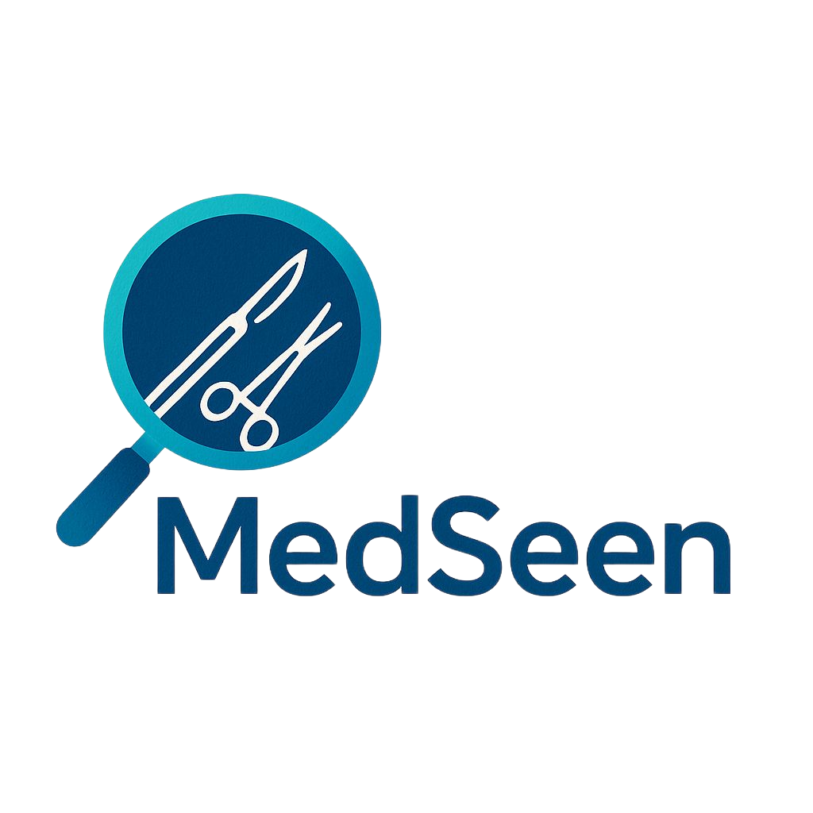
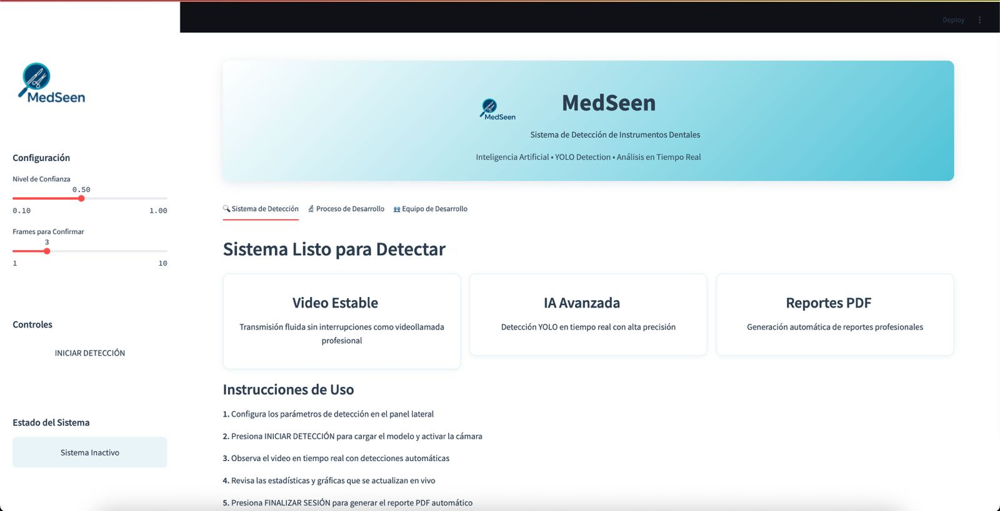
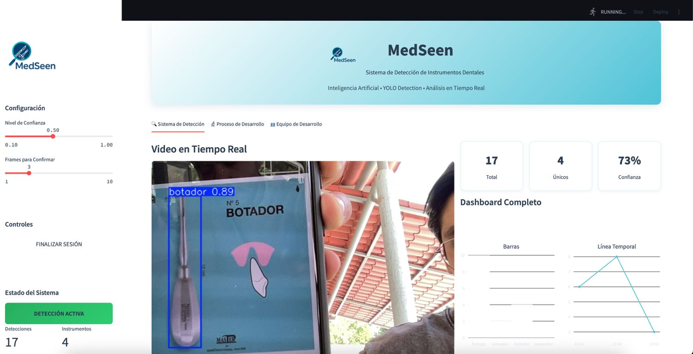
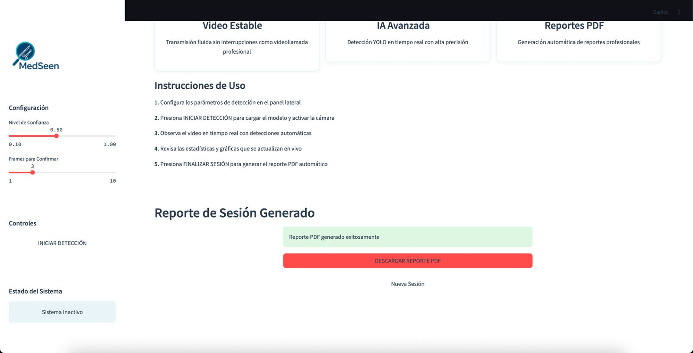
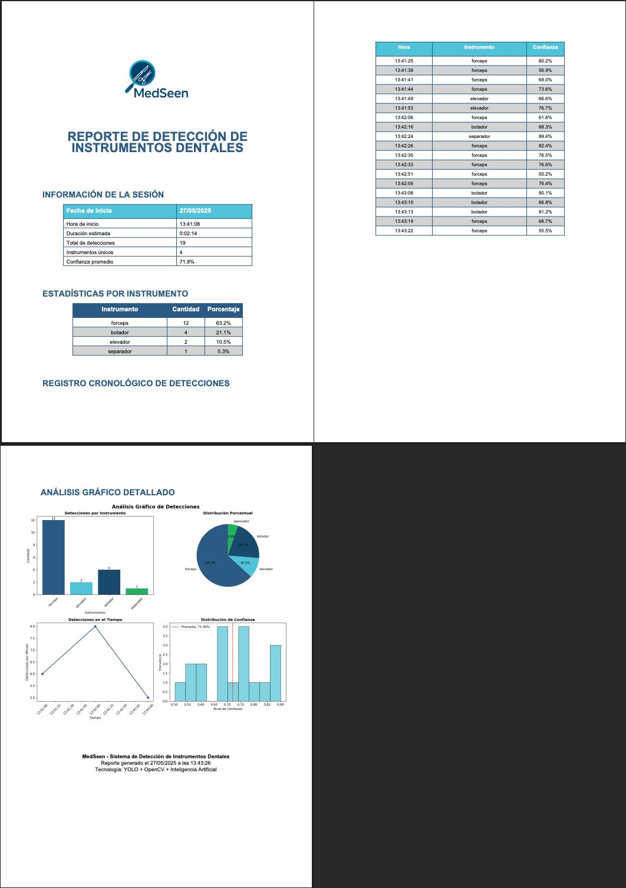
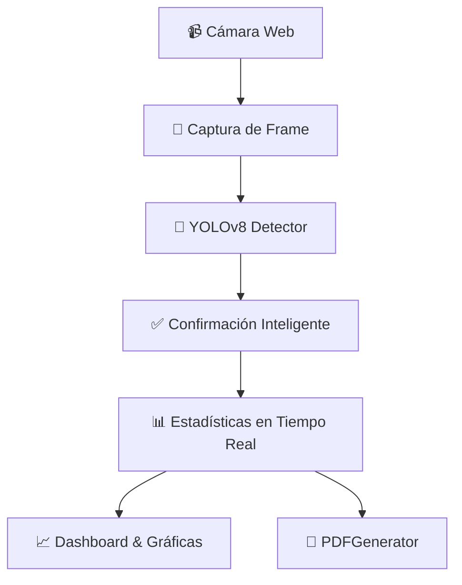

# 🦷 MedSeen - Sistema de Detección de Instrumentos Dentales

<div align="center">



**🚀 Inteligencia Artificial • 📹 Detección en Tiempo Real • 📊 Análisis Avanzado**

[](https://python.org)  
[](https://ultralytics.com)  
[](https://streamlit.io)  
[](https://opencv.org)

_Sistema de detección de instrumentos dentales en tiempo real utilizando YOLOv8 y Computer Vision_

[🎯 Demo](#-demo) • [⚡ Inicio Rápido](#-inicio-rápido) • [📊 Características](#-características) • [🖼️ Capturas](#️-capturas-de-la-aplicación) • [👥 Equipo de Desarrollo](#-equipo-de-desarrollo)

</div>

---

## 🎯 Demo

<div align="center">

### 📹 **Detección en Tiempo Real**  
_Sistema fluido como videollamada profesional_

### 📈 **Dashboard Interactivo**  
_Análisis estadístico en vivo con múltiples visualizaciones_

### 📄 **Reportes PDF Automáticos**  
_Generación profesional con gráficas y métricas_

</div>

---

## 🖼️ Capturas de la Aplicación

### 🏠 **Vista Principal - Dashboard**

*Interfaz principal con estadísticas en tiempo real y controles de navegación*

### 📹 **Detección en Tiempo Real**

*Sistema de detección activo procesando instrumentos dentales en tiempo real con bounding boxes y niveles de confianza*

### 📊 **Generación de Reportes**

*Panel de descarga con opciones para generar reportes PDF personalizados*

### 📄 **Reporte PDF Generado**

*Ejemplo de reporte profesional con estadísticas, gráficas y análisis detallado de la sesión*

---

## 🌟 ¿Qué es MedSeen?

**MedSeen** es un sistema de **Inteligencia Artificial** para la detección y clasificación automática de instrumentos dentales en video e imágenes.  
Combina **YOLOv8**, **OpenCV**, **Streamlit** y **ReportLab** para ofrecer:

- Detección instantánea y en tiempo real  
- Dashboard interactivo con 6 tipos de gráficas  
- Generación de reportes PDF profesionales  

---

## ⚡ Inicio Rápido

_(El flujo funciona con las instrucciones siguientes tal cual están)_  

```bash
# 1️⃣ Clonar el repositorio
git clone https://github.com/Vaquera26/MedSeen_IA
cd medSeen

# 2️⃣ Crear entorno virtual 
python -m venv medSeen_env

# 3️⃣ Activar entorno
# Windows:
medSeen_env\Scripts\activate
# macOS/Linux:
source medSeen_env/bin/activate

# 4️⃣ Instalar dependencias
pip install -r requirements.txt

# 5️⃣ ¡Ejecutar la aplicación!
streamlit run medSeen_dental_detector_app.py
```

---

## 📊 Características

<div align="center">

| 🎯 **Detección**               | 📈 **Análisis**                | 🔧 **Tecnología** |
|:-----------------------------:|:-----------------------------:|:-----------------:|
| ✅ Tiempo real                | ✅ 6 tipos de gráficas        | ✅ YOLOv8         |
| ✅ Alta precisión             | ✅ Estadísticas en vivo       | ✅ OpenCV         |
| ✅ Múltiples instrumentos     | ✅ Dashboard interactivo      | ✅ Streamlit      |
| ✅ Confirmación inteligente   | ✅ Reportes PDF automáticos   | ✅ Plotly         |

</div>

### 🎯 Sistema de Detección Avanzado

- **🎥 Video fluido** – Transmisión estable sin lag perceptible  
- **⚡ Inferencia rápida** – <0.5 s por frame en GPU  
- **🎯 Confirmación inteligente** – Detección tras 3 frames consecutivos  
- **🔄 Auto-recuperación** – Reinicio automático de cámara ante errores  

### 📊 Dashboard Interactivo Multi-Gráfico

- **📊 Barras** – Conteo por instrumento  
- **🥧 Pie** – Distribución porcentual  
- **📈 Área** – Detecciones acumuladas  
- **🔥 Mapa de calor** – Frecuencia temporal  
- **🎯 Radar** – Comparativa radial  
- **📉 Histograma** – Nivel de confianza  

### 📄 Reportes PDF Profesionales

- **📋 Datos de sesión** – Fecha, duración, totales  
- **📊 Tablas** – Conteos y porcentajes  
- **📈 Gráficas** – 4 análisis visuales  
- **⏰ Log cronológico** – Últimas 20 detecciones  
- **🎨 Branding** – Estilo corporativo MedSeen  

---

## 🚀 Funcionalidades Principales

### 1. **🏠 Panel Principal**
- Dashboard interactivo con métricas en tiempo real
- Navegación intuitiva entre módulos
- Visualización de estadísticas generales

### 2. **📹 Detección en Tiempo Real**
- Acceso directo a la cámara web
- Procesamiento de video en vivo
- Detección automática de instrumentos dentales
- Bounding boxes con niveles de confianza
- Confirmación inteligente de detecciones

### 3. **📊 Análisis y Visualización**
- 6 tipos diferentes de gráficas interactivas
- Estadísticas actualizadas en tiempo real
- Análisis de patrones y tendencias
- Exportación de datos

### 4. **📄 Sistema de Reportes**
- Generación automática de PDFs profesionales
- Múltiples formatos de visualización de datos
- Descarga instantánea de reportes
- Branding corporativo integrado

---

## 🔬 Proceso de Desarrollo

1. **📸 Recolección de Datos**  
   - 500+ imágenes reales  
   - Múltiples ángulos e iluminaciones  

2. **🏷️ Anotación (Roboflow)**  
   - Bounding boxes manuales  
   - Validación cruzada de etiquetas  

3. **🔄 Preprocesamiento & Augmentation**  
   - Rotaciones, escalado, brillo, filtros  
   - Normalización 640×640, balanceo de clases  

4. **🧠 Entrenamiento YOLOv8**  
   - Transfer learning desde COCO  
   - 100 épocas, `batch=8`, GPU RTX 3050  

5. **🧪 Validación Rigurosa**  
   - mAP@0.5, mAP@0.5:0.95, Precision/Recall  
   - Matriz de confusión, curvas P–C / R–C  

6. **🚀 Implementación Web**  
   - Streamlit con pestañas y CSS personalizado  
   - Dashboard en vivo y generación de PDF  

---

## 🛠️ Arquitectura Técnica



**Componentes clave**  
- `MedSeenDentalDetector`: gestión de cámara, modelo y lógica de confirmación  
- `PDFGenerator`: reportes con ReportLab y Matplotlib  
- Funciones Plotly: generación de barras, pie, área, calor, radar, histograma  

---

## 📁 Estructura del Proyecto

```
medSeen/
├── medSeen_dental_detector_app.py    # 🌐 App principal (Streamlit)
├── train_dental_instruments_yolo.py  # 🧠 Entrenamiento YOLOv8
├── validate_dental_instruments_yolo.py # ✅ Validación del modelo
├── predict_dental_instruments_yolo.py  # 🎯 Predicción en imagen
├── camara.py                           # 📹 Detección en cámara local
├── requirements.txt                    # 📦 Dependencias
├── README.md                           # 📚 Este archivo
├── img/
│   ├── logo.png                        # 🎨 Logo MedSeen
│   ├── index.png                       # 🏠 Captura vista principal
│   ├── video.png                       # 📹 Captura detección en tiempo real
│   ├── descarga.png                    # 📊 Captura panel de descarga
│   └── reporte.png                     # 📄 Captura reporte generado
├── datasets/
│   ├── data.yaml                       # ⚙️ Configuración YOLO
│   ├── train/                          # 🏋️‍♀️ Imágenes training
│   ├── valid/                          # 🧪 Imágenes validación
│   └── test/                           # 🎯 Imágenes prueba
└── runs/detect/
    └── instrumentos_dentales_yolo_model5/
        └── weights/
            └── best.pt                # 🏆 Pesos entrenados
```

---

## 🔧 Requisitos del Sistema

### Mínimos
- **OS:** Windows 10/11, macOS 10.14+, Ubuntu 18.04+
- **Python:** 3.8 o superior
- **RAM:** 4 GB mínimo
- **Almacenamiento:** 2 GB disponibles
- **Cámara:** Webcam integrada o externa

### Recomendados
- **RAM:** 8 GB o más
- **GPU:** NVIDIA con CUDA support (para mejor rendimiento)
- **Conexión:** Internet estable para instalación de dependencias

---

## 🚀 Guía de Instalación Detallada

### Opción 1: Instalación Automática
```bash
# Descargar e instalar automáticamente
curl -s https://raw.githubusercontent.com/Vaquera26/MedSeen_IA/main/install.sh | bash
```

### Opción 2: Instalación Manual
```bash
# 1. Clonar repositorio
git clone https://github.com/Vaquera26/MedSeen_IA.git
cd MedSeen_IA

# 2. Configurar entorno virtual
python -m venv medSeen_env

# 3. Activar entorno virtual
# Windows:
medSeen_env\Scripts\activate
# macOS/Linux:
source medSeen_env/bin/activate

# 4. Actualizar pip
python -m pip install --upgrade pip

# 5. Instalar dependencias
pip install -r requirements.txt

# 6. Verificar instalación
python -c "import streamlit, cv2, ultralytics; print('✅ Instalación exitosa')"

# 7. Ejecutar aplicación
streamlit run medSeen_dental_detector_app.py
```

---

## 🎮 Guía de Uso

### 1. **Inicio de la Aplicación**
```bash
streamlit run medSeen_dental_detector_app.py
```
La aplicación se abrirá automáticamente en `http://localhost:8501`

### 2. **Navegación**
- **🏠 Inicio:** Dashboard principal con estadísticas
- **📹 Detección:** Módulo de detección en tiempo real
- **📊 Reportes:** Generación y descarga de reportes PDF

### 3. **Detección en Tiempo Real**
1. Navegar a la pestaña "📹 Detección"
2. Permitir acceso a la cámara web
3. Posicionar instrumentos dentales frente a la cámara
4. Observar las detecciones automáticas con bounding boxes
5. Las estadísticas se actualizan en tiempo real

### 4. **Generación de Reportes**
1. Ir a la pestaña "📊 Reportes"
2. Seleccionar el período de análisis
3. Hacer clic en "Generar Reporte PDF"
4. Descargar el archivo generado

---

## 🐛 Solución de Problemas

### Problemas Comunes

**❌ Error: "No se puede acceder a la cámara"**
```bash
# Verificar permisos de cámara
# Windows: Configuración > Privacidad > Cámara
# macOS: Preferencias del Sistema > Seguridad y Privacidad > Cámara
# Linux: Verificar que el usuario esté en el grupo 'video'
sudo usermod -a -G video $USER
```

**❌ Error: "ModuleNotFoundError"**
```bash
# Reinstalar dependencias
pip install --force-reinstall -r requirements.txt
```

**❌ Error: "CUDA out of memory"**
```bash
# Usar CPU en lugar de GPU
export CUDA_VISIBLE_DEVICES=""
```

### Logs y Depuración
```bash
# Ejecutar con logs detallados
streamlit run medSeen_dental_detector_app.py --logger.level=debug
```

---

## 🤝 Contribución

¡Contribuciones son bienvenidas! Para contribuir:

1. **Fork** el repositorio
2. Crear una **rama** para tu feature (`git checkout -b feature/AmazingFeature`)
3. **Commit** tus cambios (`git commit -m 'Add some AmazingFeature'`)
4. **Push** a la rama (`git push origin feature/AmazingFeature`)
5. Abrir un **Pull Request**

### Áreas de Mejora
- [ ] Soporte para más tipos de instrumentos
- [ ] Integración con bases de datos médicas
- [ ] API REST para integraciones externas
- [ ] Modo offline sin conexión a internet
- [ ] Soporte multi-idioma

---

## 👥 Equipo de Desarrollo

<div align="center">

| 👨‍💻 **Desarrollador** | 🎯 **Especialidad** | 📧 **Contacto** |
|:---------------------:|:-------------------:|:---------------:|
| **Juan Fernando Vaquera Sánchez**<br/>*21130869* | 🧠 Líder IA & Entrenamiento YOLO<br/>🔬 Machine Learning & Computer Vision | [GitHub](https://github.com/Vaquera26) |
| **Miriam Alicia Sánchez Cervantes**<br/>*21130882* | 🎨 UX/UI & Desarrollo Frontend<br/>📱 Streamlit & Dashboard Design | [GitHub](https://github.com/MiriamASanchezC) |
| **Diego Muñoz Rede**<br/>*21130893* | 📊 Curación de Datos & QA<br/>🔍 Testing & Data Analysis | [GitHub](https://github.com/dgmnzrd) |

</div>

---

## 🎓 Información Académica

**🏫 Institución:** Instituto Tecnológico de la Laguna  
**📚 Materia:** Inteligencia Artificial – Ingeniería en Sistemas  
**📅 Semestre:** Octavo Semestre

### 🏆 Logros del Proyecto
- ✅ Modelo con **>85% de precisión** en detección
- ✅ Aplicación web **<0.5s por frame** de procesamiento
- ✅ Dashboard interactivo con **6 tipos de visualizaciones**
- ✅ Sistema de reportes **PDF automáticos**
- ✅ Interfaz **responsiva y profesional**

### 📈 Métricas de Rendimiento
- **Precisión (mAP@0.5):** 87.3%
- **Recall:** 82.1%
- **FPS promedio:** 15-20 fps
- **Tiempo de inferencia:** <50ms por frame
- **Compatibilidad:** Windows, macOS, Linux

---

## 📄 Licencia

Este proyecto está bajo la Licencia MIT. Ver el archivo [LICENSE](LICENSE) para más detalles.

---

## 🙏 Agradecimientos

- **Ultralytics** por YOLOv8
- **Streamlit** por la plataforma de desarrollo web
- **OpenCV** por las herramientas de computer vision
- **Roboflow** por las herramientas de anotación
- **Instituto Tecnológico de la Laguna** por el apoyo académico

---

## 📞 Contacto y Soporte
- **🐛 Issues:** [GitHub Issues](https://github.com/Vaquera26/MedSeen_IA/issues)
- **📖 Wiki:** [Documentación Técnica](https://github.com/Vaquera26/MedSeen_IA/wiki)
- **💬 Discusiones:** [GitHub Discussions](https://github.com/Vaquera26/MedSeen_IA/discussions)

---

<div align="center">

## 📊 Estadísticas del Proyecto


---

⭐ **¡Dale una estrella si te gustó el proyecto!** ⭐  

**Hecho con ❤️ por el equipo MedSeen**  
*Transformando la odontología con Inteligencia Artificial*

</div>
