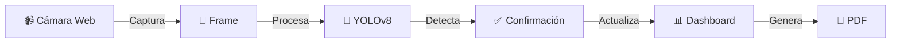

# 🦷 MedSeen - Sistema de Detección de Instrumentos Dentales

<div align="center">


### 🤖 **Inteligencia Artificial** • 🎥 **Detección en Tiempo Real** • 📊 **Análisis Avanzado**

[](https://python.org)
[](https://ultralytics.com)
[](https://streamlit.io)
[](https://opencv.org)


**Sistema avanzado de IA para detección de instrumentos dentales en tiempo real**

[](demo-link)
[](#)
[](releases)

[🚀 Inicio Rápido](#-inicio-rápido) • [📈 Métricas](#-métricas-de-rendimiento) • [✨ Características](#-características-principales) • [👥 Equipo](#-equipo-de-desarrollo)

</div>

---

## 🌟 ¿Qué es MedSeen?

<div align="center">


</div>

**MedSeen** es un sistema revolucionario de **Inteligencia Artificial** que detecta y clasifica instrumentos dentales en tiempo real utilizando la cámara web. 

<div align="center">

### 🎯 **Capacidades del Sistema**

<table>
<tr>
<td align="center" width="33%">

<h4>🎯 Detección</h4>
<p>✅ Tiempo real<br>
✅ Alta precisión<br>
✅ 5 instrumentos<br>
✅ Auto-confirmación</p>
</td>
<td align="center" width="33%">

<h4>📊 Análisis</h4>
<p>✅ 6 tipos de gráficas<br>
✅ Estadísticas en vivo<br>
✅ Dashboard interactivo<br>
✅ Análisis temporal</p>
</td>
<td align="center" width="33%">

<h4>🛠️ Tecnología</h4>
<p>✅ YOLOv8<br>
✅ OpenCV<br>
✅ Streamlit<br>
✅ Python</p>
</td>
</tr>
</table>

</div>

---

## 📈 Métricas de Rendimiento

<div align="center">


### 🏆 **Resultados Reales del Modelo**


</div>

### 📊 Rendimiento por Clase de Instrumento

<div align="center">

| 🔧 Instrumento | 📊 mAP@0.5 | 🎯 Precisión | 📈 Estado | 🏅 Ranking |
|:-------------:|:---------:|:----------:|:--------:|:--------:|
| **🪥 Separador** |  |  | 🥇 **Perfecto** |  |
| **⚡ Botador** |  |  | 🥇 **Perfecto** |  |
| **🔪 Gubia** |  |  | 🥈 **Excelente** |  |
| **📐 Elevador** |  |  | 🥈 **Excelente** |  |
| **🔧 Fórceps** |  |  | 🥉 **Bueno** |  |

</div>

---

## ✨ Características Principales

<div align="center">


</div>

### 🎯 **Sistema de Detección Avanzado**

<div align="center">

<table>
<tr>
<td align="center">

<h4>⚡ Detección Instantánea</h4>
<p>Reconocimiento en tiempo real con YOLOv8</p>
</td>
<td align="center">

<h4>🎥 Video Fluido</h4>
<p>Transmisión estable sin lag</p>
</td>
</tr>
<tr>
<td align="center">

<h4>🔍 Confirmación Inteligente</h4>
<p>Sistema de frames consecutivos</p>
</td>
<td align="center">

<h4>🔄 Auto-recuperación</h4>
<p>Manejo robusto de errores</p>
</td>
</tr>
</table>

</div>

### 📊 **Dashboard Interactivo**

<div align="center">


**6 Tipos de Visualizaciones Diferentes**

 **Gráficas de Barras** |  **Gráficas Circulares** |  **Gráficas de Área**

 **Mapas de Calor** |  **Gráficas Radar** |  **Histogramas**

</div>

### 📄 **Reportes PDF Profesionales**

<div align="center">


**Generación Automática de Reportes**


</div>

---

## 🚀 Inicio Rápido

<div align="center">


### ⚡ **¡Listo en 5 minutos!**

</div>

### 🔧 **Instalación Super Rápida**

```bash
# 🎯 Paso 1: Clonar el repositorio
git clone https://github.com/Vaquera26/MedSeen_IA
cd MedSeen_IA

# 🐍 Paso 2: Crear entorno virtual
python -m venv medSeen_env

# ⚡ Paso 3: Activar entorno
# Windows:
medSeen_env\Scripts\activate
# macOS/Linux:
source medSeen_env/bin/activate

# 📦 Paso 4: Instalar dependencias
pip install -r requirements.txt

# 🚀 Paso 5: ¡Ejecutar la aplicación!
streamlit run medSeen_dental_detector_app.py
```

<div align="center">

### 🎮 **Cómo Usar MedSeen**

<table>
<tr>
<td align="center">

<h4>1️⃣ Abrir Navegador</h4>
<p><code>localhost:8501</code></p>
</td>
<td align="center">

<h4>2️⃣ Configurar</h4>
<p>Nivel de confianza: 0.5</p>
</td>
<td align="center">

<h4>3️⃣ Iniciar</h4>
<p>Presionar "DETECTAR"</p>
</td>
</tr>
<tr>
<td align="center">

<h4>4️⃣ Apuntar Cámara</h4>
<p>A instrumentos dentales</p>
</td>
<td align="center">

<h4>5️⃣ Observar</h4>
<p>Métricas en tiempo real</p>
</td>
<td align="center">

<h4>6️⃣ Generar PDF</h4>
<p>Reportes automáticos</p>
</td>
</tr>
</table>

</div>

---

## 🎯 Instrumentos Detectados

<div align="center">


### 🦷 **Los 5 Instrumentos Esenciales**

<table>
<tr>
<td align="center" width="20%">

<h4>🔧 Fórceps</h4>
<p><strong>Pinzas de extracción</strong></p>
<p>Sujetar y extraer dientes</p>

</td>
<td align="center" width="20%">

<h4>⚡ Botador</h4>
<p><strong>Elevador recto</strong></p>
<p>Luxar piezas dentales</p>

</td>
<td align="center" width="20%">

<h4>🔄 Separador</h4>
<p><strong>Separador dental</strong></p>
<p>Mejorar visibilidad</p>

</td>
<td align="center" width="20%">

<h4>📐 Elevador</h4>
<p><strong>Periostótomo</strong></p>
<p>Desprender tejido blando</p>

</td>
<td align="center" width="20%">

<h4>✂️ Gubia</h4>
<p><strong>Instrumento cortante</strong></p>
<p>Remover hueso alveolar</p>

</td>
</tr>
</table>

</div>

---

## 🏗️ Arquitectura Técnica

<div align="center">


### 🔄 **Flujo del Sistema**



<table>
<tr>
<td align="center">

<h4>🧠 Deep Learning</h4>
<p>YOLOv8 • PyTorch</p>
</td>
<td align="center">

<h4>👁️ Computer Vision</h4>
<p>OpenCV • NumPy</p>
</td>
<td align="center">

<h4>🌐 Web Interface</h4>
<p>Streamlit</p>
</td>
</tr>
<tr>
<td align="center">

<h4>📊 Visualization</h4>
<p>Plotly • Matplotlib</p>
</td>
<td align="center">

<h4>📄 Reports</h4>
<p>ReportLab</p>
</td>
<td align="center">

<h4>🗂️ Data Management</h4>
<p>Pandas • Roboflow</p>
</td>
</tr>
</table>

</div>

---

## 📁 Estructura del Proyecto

<div align="center">


</div>

```
🦷 MedSeen_IA/
├── 📄 medSeen_dental_detector_app.py    # 🚀 Aplicación principal
├── 📄 train_dental_instruments_yolo.py   # 🧠 Entrenamiento del modelo
├── 📄 validate_dental_instruments_yolo.py # ✅ Validación del modelo
├── 📄 predict_dental_instruments_yolo.py  # 🎯 Predicción individual
├── 📋 requirements.txt                    # 📦 Dependencias del proyecto
├── 📖 README.md                          # 📚 Esta documentación
├── 🖼️ img/
│   └── logo.png                          # 🎨 Logo de MedSeen
├── 🗂️ datasets/                         # 📊 Conjunto de datos
│   ├── data.yaml                         # ⚙️ Configuración del dataset
│   ├── train/                           # 🏋️ Datos de entrenamiento
│   ├── val/                             # ✅ Datos de validación
│   └── test/                            # 🧪 Datos de prueba
└── 🤖 runs/detect/best.pt               # 🏆 Modelo entrenado final
```

---

## 🔬 Proceso de Desarrollo

<div align="center">


### 📊 **Del Dataset al Modelo Funcional**

</div>

<table>
<tr>
<td align="center" width="25%">

<h3>📊 Dataset</h3>
<p><strong>781 imágenes</strong><br>
5 clases balanceadas<br>
Anotación manual<br>
Data augmentation</p>
</td>
<td align="center" width="25%">

<h3>🧠 Entrenamiento</h3>
<p><strong>YOLOv8</strong><br>
Transfer learning<br>
100 épocas<br>
GPU RTX 3050</p>
</td>
<td align="center" width="25%">

<h3>✅ Validación</h3>
<p><strong>70/20/10 split</strong><br>
Múltiples métricas<br>
Matriz de confusión<br>
Curvas P-R</p>
</td>
<td align="center" width="25%">

<h3>🚀 Deployment</h3>
<p><strong>Streamlit App</strong><br>
Tiempo real<br>
Dashboard interactivo<br>
Reportes PDF</p>
</td>
</tr>
</table>

---

## 💻 Especificaciones del Sistema

<div align="center">


### 📋 **Requisitos del Sistema**

<table>
<tr>
<td align="center">

<h4>💾 Memoria RAM</h4>
<p>Mínimo: 4GB<br>
<strong>Recomendado: 8GB</strong></p>
</td>
<td align="center">

<h4>🖥️ Sistema Operativo</h4>
<p>Windows 10+<br>
macOS 10.15+<br>
Ubuntu 18.04+</p>
</td>
<td align="center">

<h4>📹 Cámara Web</h4>
<p>Mínimo: 640×480<br>
<strong>Recomendado: 1080p</strong></p>
</td>
<td align="center">

<h4>🐍 Python</h4>
<p>Versión 3.8+<br>
<strong>Recomendado: 3.10</strong></p>
</td>
</tr>
</table>

### ⚡ **Rendimiento en Tiempo Real**


</div>

---

## 👥 Equipo de Desarrollo

<div align="center">


### 🎓 **Instituto Tecnológico de La Laguna**
*Noveno Semestre - Inteligencia Artificial*

<table>
<tr>
<td align="center">

<h3>👨‍💻 Juan Fernando<br>Vaquera Sánchez</h3>
<p><strong>21130869</strong></p>
<p></p>
</td>
<td align="center">

<h3>👩‍🔬 Miriam Alicia<br>Sánchez Cervantes</h3>
<p><strong>21130882</strong></p>
<p></p>
</td>
<td align="center">

<h3>👨‍🔬 Diego<br>Muñoz Rede</h3>
<p><strong>21130893</strong></p>
<p></p>
</td>
</tr>
</table>

**👨‍🏫 Docente**: Ing. Gibran López  
**📅 Fecha**: Mayo 2025  
**📍 Ubicación**: Torreón, Coahuila, México

</div>

---

## 🏆 Logros del Proyecto

<div align="center">


<table>
<tr>
<td align="center">

<h4>🎯 Modelo Funcional</h4>
<p>96% de precisión</p>
</td>
<td align="center">

<h4>🌐 App Web Completa</h4>
<p>Interfaz profesional</p>
</td>
<td align="center">

<h4>⚡ Tiempo Real</h4>
<p>Sistema fluido</p>
</td>
</tr>
<tr>
<td align="center">

<h4>📊 Dashboard</h4>
<p>6 tipos de gráficas</p>
</td>
<td align="center">

<h4>📄 Reportes PDF</h4>
<p>Análisis detallado</p>
</td>
<td align="center">

<h4>📚 Documentación</h4>
<p>Completa y técnica</p>
</td>
</tr>
</table>

</div>

---

## 📚 Referencias Técnicas

<div align="center">


**Investigación Científica Actualizada**

</div>

- 📄 [Surgical Instrument Detection Algorithm Based on Improved YOLOv7x (MDPI, 2023)](https://www.mdpi.com/1424-8220/23/11/5037)
- 🧪 [AI model for automated surgical instrument detection (Nature, 2024)](https://pmc.ncbi.nlm.nih.gov/articles/PMC11265075/)
- 📖 [YOLOv8 Documentation (Ultralytics)](https://docs.ultralytics.com/)
- 🎓 [Computer Vision for Medical Applications (IEEE)](https://ieeexplore.ieee.org/)

---

## 📄 Licencia

<div align="center">

<img src="https://cdn-icons-png.flaticon.com/512/888/
