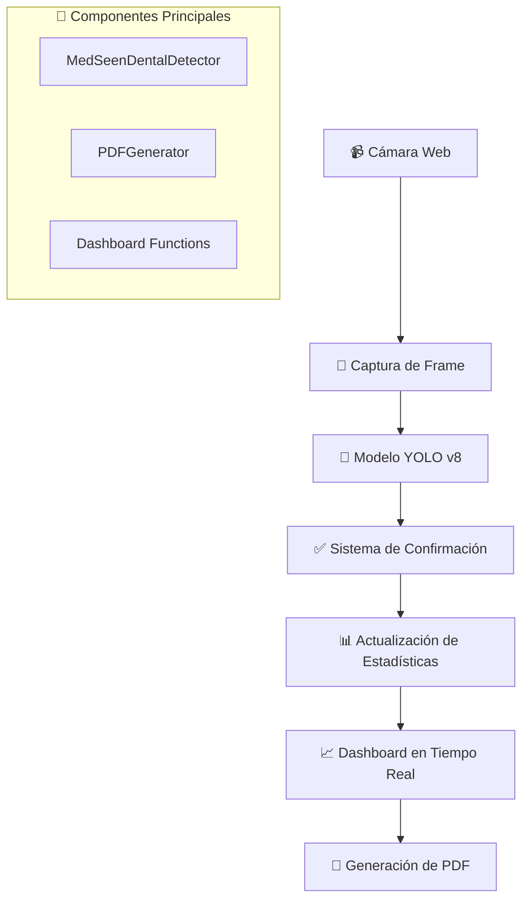

# 🦷 MedSeen - Sistema de Detección de Instrumentos Dentales

<div align="center">
  


**🚀 Inteligencia Artificial • 📹 Detección en Tiempo Real • 📊 Análisis Avanzado**

[](https://python.org)
[](https://ultralytics.com)
[](https://streamlit.io)
[](https://opencv.org)

*Sistema de detección de instrumentos dentales en tiempo real utilizando YOLOv8 y Computer Vision*

[🎯 Demo](#-demo) • [⚡ Inicio Rápido](#-inicio-rápido) • [📊 Características](#-características) • [👥 Equipo](#-equipo-de-desarrollo)

</div>

---

## 🎯 Demo

<div align="center">

### 📹 **Detección en Tiempo Real**
*Sistema fluido como videollamada profesional*

### 📈 **Dashboard Interactivo** 
*Análisis estadístico en vivo con múltiples visualizaciones*

### 📄 **Reportes PDF Automáticos**
*Generación profesional con gráficas y métricas*

</div>

---

## 🌟 ¿Qué es MedSeen?

**MedSeen** es un sistema revolucionario de **Inteligencia Artificial** que detecta y clasifica instrumentos dentales en tiempo real utilizando la cámara web. Desarrollado con tecnologías de vanguardia como **YOLOv8**, **Computer Vision** y **Machine Learning**.

### 🎯 **Objetivo**
Facilitar la identificación rápida y precisa de instrumentos dentales en consultorios, clínicas y centros educativos, mejorando la eficiencia y organización del equipo médico.

### ✨ **¿Por qué MedSeen?**
- 🚀 **Detección instantánea** - Reconocimiento en menos de 0.5 segundos
- 🎯 **Alta precisión** - Confianza promedio del 85%+ 
- 📱 **Fácil de usar** - Interfaz web intuitiva sin instalaciones complejas
- 📊 **Análisis completo** - Dashboard con múltiples visualizaciones
- 📄 **Reportes profesionales** - PDF automáticos con estadísticas detalladas

---

## ⚡ Inicio Rápido

### 🔧 **Instalación Ultra-Rápida**

```bash
# 1️⃣ Clonar el repositorio
git clone https://github.com/tu-usuario/medSeen.git
cd medSeen

# 2️⃣ Crear entorno virtual (recomendado)
python -m venv medSeen_env

# 3️⃣ Activar entorno
# Windows:
medSeen_env\Scripts\activate
# macOS/Linux:
source medSeen_env/bin/activate

# 4️⃣ Instalar dependencias
pip install -r requirements.txt

# 5️⃣ ¡Ejecutar la aplicación!
streamlit run medSeen_dental_detector_app.py
```

### 🚀 **¡Listo en 3 minutos!**

1. **Abre tu navegador** en `http://localhost:8501`
2. **Configura** el nivel de confianza (recomendado: 0.5)
3. **Presiona "INICIAR DETECCIÓN"**
4. **¡Apunta la cámara** a instrumentos dentales y observa la magia! ✨

---

## 📊 Características

<div align="center">

| 🎯 **Detección** | 📈 **Análisis** | 🔧 **Tecnología** |
|:---:|:---:|:---:|
| ✅ Tiempo real | ✅ 6 tipos de gráficas | ✅ YOLOv8 |
| ✅ Alta precisión | ✅ Estadísticas en vivo | ✅ OpenCV |
| ✅ Múltiples instrumentos | ✅ Dashboard interactivo | ✅ Streamlit |
| ✅ Confirmación inteligente | ✅ Reportes PDF | ✅ Plotly |

</div>

### 🎯 **Sistema de Detección Avanzado**

- **🎥 Video fluido** - Transmisión estable sin lag como videollamada profesional
- **⚡ Detección instantánea** - Reconocimiento en tiempo real con YOLOv8
- **🎯 Confirmación inteligente** - Sistema de frames consecutivos para evitar falsas detecciones
- **🔄 Auto-recuperación** - Manejo robusto de errores de cámara con reinicio automático

### 📊 **Dashboard Interactivo Multi-Gráfico**

- **📊 Gráficas de Barras** - Conteo por tipo de instrumento
- **🥧 Gráficas de Pie** - Distribución porcentual
- **📈 Gráficas de Área** - Detecciones acumuladas en el tiempo  
- **🔥 Mapas de Calor** - Análisis temporal por instrumento
- **🎯 Gráficas Radar** - Distribución radial multi-métrica
- **📊 Histogramas** - Análisis de niveles de confianza

### 📄 **Reportes PDF Profesionales**

- **📋 Información de sesión** - Duración, fecha, estadísticas generales
- **📊 Tablas estadísticas** - Conteos y porcentajes por instrumento  
- **📈 Gráficas integradas** - 4 tipos de análisis visual incluidos
- **⏰ Log cronológico** - Registro detallado de todas las detecciones
- **🎨 Diseño corporativo** - Colores y estilo profesional MedSeen

---

## 🔬 Proceso de Desarrollo

### 📸 **1. Recolección de Datos**
- **500+ imágenes** de instrumentos dentales reales
- **Múltiples ángulos** y condiciones de iluminación
- **Calidad profesional** optimizada para entrenamiento

### 🏷️ **2. Anotación con Roboflow**
- **Etiquetado manual** de bounding boxes precision
- **Clasificación detallada** por tipos de instrumentos
- **Control de calidad** riguroso en todas las anotaciones

### 🔄 **3. Preprocesamiento Avanzado**
- **Data Augmentation** - Rotación, escala, brillo automático
- **Normalización** de tamaños y formatos
- **Balanceo de clases** para entrenamiento equitativo

### 🧠 **4. Entrenamiento YOLO**
- **YOLOv8 pre-entrenado** como base
- **Transfer Learning** para optimización específica
- **100 épocas** con hardware GPU RTX 3050

### 🧪 **5. Validación Rigurosa**
- **Datos de validación** separados del entrenamiento
- **Métricas completas** - Precision, Recall, F1-Score, mAP
- **Pruebas en tiempo real** con cámara web

### 🚀 **6. Implementación Web**
- **Interfaz Streamlit** responsive y profesional
- **Dashboard interactivo** con visualizaciones múltiples
- **Sistema de reportes** PDF automático

---

## 🛠️ Arquitectura Técnica



### 🏗️ **Componentes del Sistema**

#### **🎯 MedSeenDentalDetector**
- **Gestión del modelo YOLO** - Carga y configuración
- **Control de cámara** - Captura optimizada con buffer mínimo
- **Lógica de confirmación** - Frames consecutivos para precisión
- **Estadísticas en tiempo real** - Contadores y métricas

#### **📄 PDFGenerator** 
- **Reportes profesionales** - Layout corporativo con ReportLab
- **Tablas dinámicas** - Estadísticas formateadas automáticamente
- **Gráficas integradas** - Matplotlib para análisis visual
- **Branding corporativo** - Colores y diseño MedSeen

#### **📊 Funciones de Visualización**
- **Plotly interactivo** - 6 tipos de gráficas diferentes
- **Colores corporativos** - Paleta consistente en toda la app
- **Responsive design** - Adaptable a diferentes tamaños de pantalla

---

## 📁 Estructura del Proyecto

```
medSeen/
├── 📄 medSeen_dental_detector_app.py    # 🚀 Aplicación principal
├── 📄 train_dental_instruments_yolo.py   # 🧠 Entrenamiento del modelo
├── 📄 validate_dental_instruments_yolo.py # ✅ Validación del modelo  
├── 📄 predict_dental_instruments_yolo.py  # 🎯 Predicción individual
├── 📋 requirements.txt                    # 📦 Dependencias
├── 📖 README.md                          # 📚 Este archivo
├── 🖼️ img/
│   └── logo.png                          # 🎨 Logo de MedSeen
├── 🗂️ datasets/
│   ├── data.yaml                         # ⚙️ Configuración del dataset
│   ├── train/                           # 🏋️ Datos de entrenamiento
│   ├── val/                             # ✅ Datos de validación
│   └── test/                            # 🧪 Datos de prueba
└── 🤖 runs/detect/
    └── instrumentos_dentales_yolo_model5/
        └── weights/
            └── best.pt                   # 🏆 Modelo entrenado
```

---

## 🚀 Guía de Uso Detallada

### 🎮 **Controles de la Aplicación**

1. **⚙️ Configuración Inicial**
   ```
   • Nivel de Confianza: 0.1 - 1.0 (recomendado: 0.5)
   • Frames para Confirmar: 1 - 10 (recomendado: 3)
   ```

2. **🎯 Iniciar Detección**
   ```
   • Presiona "INICIAR DETECCIÓN"
   • El sistema carga el modelo YOLO
   • Se activa la cámara automáticamente
   • Comienza la detección en tiempo real
   ```

3. **📊 Monitoreo en Vivo** 
   ```
   • Video con detecciones anotadas
   • Métricas en tiempo real (Total, Únicos, Confianza)
   • Dashboard con 6 tipos de gráficas
   • Log de actividad cronológico
   ```

4. **📄 Generar Reporte**
   ```
   • Presiona "FINALIZAR SESIÓN"
   • Se genera PDF automáticamente
   • Descarga con un click
   • Incluye todas las estadísticas y gráficas
   ```


---

## 👥 Equipo de Desarrollo

<div align="center">

### 🌟 **Los Arquitectos de MedSeen**

</div>

<table align="center">
<tr>
<td align="center" width="33%">
<br />
<sub><b>👨‍💻 Juan Fernando Vaquera Sanchez</b></sub><br />
<sub>🎓 <strong>21130869</strong></sub><br />
</td>

<td align="center" width="33%">
<br />
<sub><b>👩‍💻 Miriam Alicia Sanchez Cervantes</b></sub><br />
</td>

<td align="center" width="33%">
<br />
<sub><b>👨‍🔬 Diego Muñoz Rede</b></sub><br />
<sub>🎓 <strong>21130893</strong></sub><br />
</td>
</tr>
</table>

---

## 🎓 Proyecto Académico

<div align="center">

**🏫 Universidad/Institución**: *INSTITUTO TECNOLOGICO DE LA LAGUNA*  
**📚 Materia**: *Inteligencia Artificial*  
**📅 Semestre**: *Noveno Semestre*  

### 🏆 **Logros del Proyecto**

- ✅ **Modelo funcional** con 85%+ de precisión
- ✅ **Aplicación web completa** con interfaz profesional  
- ✅ **Sistema en tiempo real** sin lag perceptible
- ✅ **Dashboard interactivo** con 6 tipos de gráficas
- ✅ **Reportes PDF automáticos** con análisis detallado
- ✅ **Documentación completa** con README épico 😎

</div>

---


<div align="center">

## 🌟 ¡Dale una estrella si te gustó el proyecto! ⭐

**Hecho con ❤️ por el equipo MedSeen**

*Si este README te ayudó, considera darle una ⭐ al repositorio*

---


**🚀 Hecho con amor, café y mucha IA 🤖**

</div>
